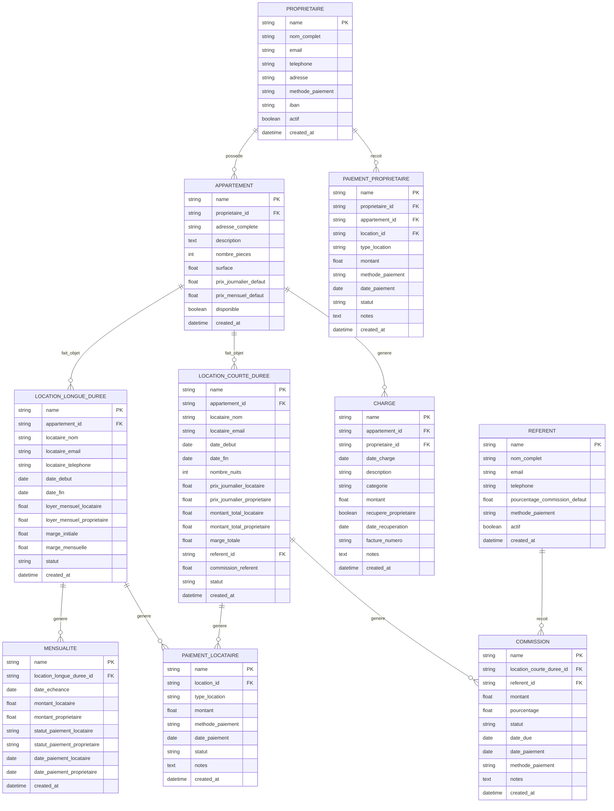

# 🏗️ Architecture Technique - Gestion Immobilière Complète

## 1. Conception de l'architecture

```mermaid
graph TD
    A[Interface Frappe] --> B[Doctypes Frappe]
    B --> C[Hooks & Validations]
    C --> D[Base de données PostgreSQL]
    B --> E[API REST Frappe]
    E --> F[Frontend React (futur)]
    
    subgraph "Couche Présentation"
        A
        F
    end
    
    subgraph "Couche Logique Métier"
        B
        C
        E
    end
    
    subgraph "Couche Données"
        D
    end
```

## 2. Description des technologies

* Frontend : Frappe Framework (interface admin) + React (interface client - futur)

* Backend : Frappe Framework (Python)

* Base de données : PostgreSQL (via Frappe)

## 3. Définitions des routes

| Route                      | Objectif                              |
| -------------------------- | ------------------------------------- |
| /app/appartement           | Gestion des appartements              |
| /app/proprietaire          | Gestion des propriétaires             |
| /app/location-longue-duree | Gestion des contrats mensuels         |
| /app/location-courte-duree | Gestion des réservations journalières |
| /app/paiement-proprietaire | Suivi des paiements aux propriétaires |
| /app/paiement-locataire    | Suivi des encaissements locataires    |
| /app/charge                | Gestion des charges                   |
| /app/referent              | Gestion des référents                 |
| /app/commission            | Suivi des commissions                 |

## 4. Définitions des API

### 4.1 API principales

**Calcul de marge location longue durée**

```
POST /api/method/immo.api.calculate_long_term_margin
```

Requête :

| Nom du paramètre | Type  | Obligatoire | Description                   |
| ---------------- | ----- | ----------- | ----------------------------- |
| monthly\_rent    | float | true        | Loyer mensuel locataire       |
| owner\_rent      | float | true        | Loyer à payer au propriétaire |

Réponse :

| Nom du paramètre | Type  | Description                          |
| ---------------- | ----- | ------------------------------------ |
| initial\_margin  | float | Marge initiale (généralement 1 mois) |
| monthly\_margin  | float | Marge mensuelle                      |

**Calcul de marge location courte durée**

```
POST /api/method/immo.api.calculate_short_term_margin
```

Requête :

| Nom du paramètre     | Type   | Obligatoire | Description                  |
| -------------------- | ------ | ----------- | ---------------------------- |
| daily\_price\_tenant | float  | true        | Prix journalier locataire    |
| daily\_price\_owner  | float  | true        | Prix journalier propriétaire |
| nights               | int    | true        | Nombre de nuits              |
| referrer\_id         | string | false       | ID du référent               |

Réponse :

| Nom du paramètre     | Type  | Description         |
| -------------------- | ----- | ------------------- |
| total\_margin        | float | Marge totale        |
| referrer\_commission | float | Commission référent |
| net\_margin          | float | Marge nette         |

## 5. Architecture serveur

```mermaid
graph TD
    A[Requête Client] --> B[Frappe Controller]
    B --> C[Validation Layer]
    C --> D[Business Logic Layer]
    D --> E[ORM Layer (Frappe)]
    E --> F[(Base de données)]
    
    subgraph Serveur Frappe
        B
        C
        D
        E
    end
```

## 6. Modèle de données

### 6.1 Définition du modèle de données



### 6.2 Langage de définition des données

**Table Propriétaire**

```sql
CREATE TABLE `tabProprietaire` (
    `name` VARCHAR(140) PRIMARY KEY,
    `nom_complet` VARCHAR(255) NOT NULL,
    `email` VARCHAR(255),
    `telephone` VARCHAR(20),
    `adresse` TEXT,
    `methode_paiement` VARCHAR(50) DEFAULT 'Virement',
    `iban` VARCHAR(34),
    `actif` BOOLEAN DEFAULT TRUE,
    `created_at` DATETIME DEFAULT NOW(),
    `modified` DATETIME DEFAULT NOW()
);

CREATE INDEX idx_proprietaire_email ON `tabProprietaire`(email);
CREATE INDEX idx_proprietaire_actif ON `tabProprietaire`(actif);
```

**Table Appartement**

```sql
CREATE TABLE `tabAppartement` (
    `name` VARCHAR(140) PRIMARY KEY,
    `proprietaire` VARCHAR(140) NOT NULL,
    `adresse_complete` TEXT NOT NULL,
    `description` TEXT,
    `nombre_pieces` INT,
    `surface` DECIMAL(6,2),
    `prix_journalier_defaut` DECIMAL(10,2),
    `prix_mensuel_defaut` DECIMAL(10,2),
    `disponible` BOOLEAN DEFAULT TRUE,
    `created_at` DATETIME DEFAULT NOW(),
    `modified` DATETIME DEFAULT NOW()
);

CREATE INDEX idx_appartement_proprietaire ON `tabAppartement`(proprietaire);
CREATE INDEX idx_appartement_disponible ON `tabAppartement`(disponible);
```

**Table Location Longue Durée**

```sql
CREATE TABLE `tabLocation Longue Duree` (
    `name` VARCHAR(140) PRIMARY KEY,
    `appartement` VARCHAR(140) NOT NULL,
    `locataire_nom` VARCHAR(255) NOT NULL,
    `locataire_email` VARCHAR(255),
    `locataire_telephone` VARCHAR(20),
    `date_debut` DATE NOT NULL,
    `date_fin` DATE,
    `loyer_mensuel_locataire` DECIMAL(10,2) NOT NULL,
    `loyer_mensuel_proprietaire` DECIMAL(10,2) NOT NULL,
    `marge_initiale` DECIMAL(10,2),
    `marge_mensuelle` DECIMAL(10,2),
    `statut` VARCHAR(20) DEFAULT 'Actif' CHECK (statut IN ('Actif', 'Terminé', 'Résilié')),
    `created_at` DATETIME DEFAULT NOW(),
    `modified` DATETIME DEFAULT NOW()
);

CREATE INDEX idx_location_ld_appartement ON `tabLocation Longue Duree`(appartement);
CREATE INDEX idx_location_ld_statut ON `tabLocation Longue Duree`(statut);
CREATE INDEX idx_location_ld_dates ON `tabLocation Longue Duree`(date_debut, date_fin);
```

**Table Location Courte Durée**

```sql
CREATE TABLE `tabLocation Courte Duree` (
    `name` VARCHAR(140) PRIMARY KEY,
    `appartement` VARCHAR(140) NOT NULL,
    `locataire_nom` VARCHAR(255) NOT NULL,
    `locataire_email` VARCHAR(255),
    `date_debut` DATE NOT NULL,
    `date_fin` DATE NOT NULL,
    `nombre_nuits` INT NOT NULL,
    `prix_journalier_locataire` DECIMAL(10,2) NOT NULL,
    `prix_journalier_proprietaire` DECIMAL(10,2) NOT NULL,
    `montant_total_locataire` DECIMAL(10,2) NOT NULL,
    `montant_total_proprietaire` DECIMAL(10,2) NOT NULL,
    `marge_totale` DECIMAL(10,2) NOT NULL,
    `referent` VARCHAR(140),
    `commission_referent` DECIMAL(10,2) DEFAULT 0,
    `statut` VARCHAR(20) DEFAULT 'Confirmé' CHECK (statut IN ('Confirmé', 'Terminé', 'Annulé')),
    `created_at` DATETIME DEFAULT NOW(),
    `modified` DATETIME DEFAULT NOW()
);

CREATE INDEX idx_location_cd_appartement ON `tabLocation Courte Duree`(appartement);
CREATE INDEX idx_location_cd_dates ON `tabLocation Courte Duree`(date_debut, date_fin);
CREATE INDEX idx_location_cd_referent ON `tabLocation Courte Duree`(referent);
```

**Table Mensualité**

```sql
CREATE TABLE `tabMensualite` (
    `name` VARCHAR(140) PRIMARY KEY,
    `location_longue_duree` VARCHAR(140) NOT NULL,
    `date_echeance` DATE NOT NULL,
    `montant_locataire` DECIMAL(10,2) NOT NULL,
    `montant_proprietaire` DECIMAL(10,2) NOT NULL,
    `statut_paiement_locataire` VARCHAR(20) DEFAULT 'En attente' CHECK (statut_paiement_locataire IN ('En attente', 'Payé', 'En retard')),
    `statut_paiement_proprietaire` VARCHAR(20) DEFAULT 'En attente' CHECK (statut_paiement_proprietaire IN ('En attente', 'Payé')),
    `date_paiement_locataire` DATE,
    `date_paiement_proprietaire` DATE,
    `created_at` DATETIME DEFAULT NOW(),
    `modified` DATETIME DEFAULT NOW()
);

CREATE INDEX idx_mensualite_location ON `tabMensualite`(location_longue_duree);
CREATE INDEX idx_mensualite_echeance ON `tabMensualite`(date_echeance);
CREATE INDEX idx_mensualite_statuts ON `tabMensualite`(statut_paiement_locataire, statut_paiement_proprietaire);
```

**Table Paiement Propriétaire**

```sql
CREATE TABLE `tabPaiement Proprietaire` (
    `name` VARCHAR(140) PRIMARY KEY,
    `proprietaire` VARCHAR(140) NOT NULL,
    `appartement` VARCHAR(140),
    `location_id` VARCHAR(140),
    `type_location` VARCHAR(20) CHECK (type_location IN ('Longue Durée', 'Courte Durée')),
    `montant` DECIMAL(10,2) NOT NULL,
    `methode_paiement` VARCHAR(50) DEFAULT 'Virement',
    `date_paiement` DATE NOT NULL,
    `statut` VARCHAR(20) DEFAULT 'En attente' CHECK (statut IN ('En attente', 'Payé', 'Annulé')),
    `notes` TEXT,
    `created_at` DATETIME DEFAULT NOW(),
    `modified` DATETIME DEFAULT NOW()
);

CREATE INDEX idx_paiement_prop_proprietaire ON `tabPaiement Proprietaire`(proprietaire);
CREATE INDEX idx_paiement_prop_statut ON `tabPaiement Proprietaire`(statut);
CREATE INDEX idx_paiement_prop_date ON `tabPaiement Proprietaire`(date_paiement DESC);
```

**Table Charge**

```sql
CREATE TABLE `tabCharge` (
    `name` VARCHAR(140) PRIMARY KEY,
    `appartement` VARCHAR(140) NOT NULL,
    `proprietaire` VARCHAR(140) NOT NULL,
    `date_charge` DATE NOT NULL,
    `description` VARCHAR(255) NOT NULL,
    `categorie` VARCHAR(50),
    `montant` DECIMAL(10,2) NOT NULL,
    `recupere_proprietaire` BOOLEAN DEFAULT FALSE,
    `date_recuperation` DATE,
    `facture_numero` VARCHAR(50),
    `notes` TEXT,
    `created_at` DATETIME DEFAULT NOW(),
    `modified` DATETIME DEFAULT NOW()
);

CREATE INDEX idx_charge_appartement ON `tabCharge`(appartement);
CREATE INDEX idx_charge_proprietaire ON `tabCharge`(proprietaire);
CREATE INDEX idx_charge_recupere ON `tabCharge`(recupere_proprietaire);
```

**Table Référent**

```sql
CREATE TABLE `tabReferent` (
    `name` VARCHAR(140) PRIMARY KEY,
    `nom_complet` VARCHAR(255) NOT NULL,
    `email` VARCHAR(255),
    `telephone` VARCHAR(20),
    `pourcentage_commission_defaut` DECIMAL(5,2) DEFAULT 10.00,
    `methode_paiement` VARCHAR(50) DEFAULT 'Virement',
    `actif` BOOLEAN DEFAULT TRUE,
    `created_at` DATETIME DEFAULT NOW(),
    `modified` DATETIME DEFAULT NOW()
);

CREATE INDEX idx_referent_email ON `tabReferent`(email);
CREATE INDEX idx_referent_actif ON `tabReferent`(actif);
```

**Table Commission**

```sql
CREATE TABLE `tabCommission` (
    `name` VARCHAR(140) PRIMARY KEY,
    `location_courte_duree` VARCHAR(140) NOT NULL,
    `referent` VARCHAR(140) NOT NULL,
    `montant` DECIMAL(10,2) NOT NULL,
    `pourcentage` DECIMAL(5,2) NOT NULL,
    `statut` VARCHAR(20) DEFAULT 'Due' CHECK (statut IN ('Due', 'Payée', 'Annulée')),
    `date_due` DATE NOT NULL,
    `date_paiement` DATE,
    `methode_paiement` VARCHAR(50),
    `notes` TEXT,
    `created_at` DATETIME DEFAULT NOW(),
    `modified` DATETIME DEFAULT NOW()
);

CREATE INDEX idx_commission_referent ON `tabCommission`(referent);
CREATE INDEX idx_commission_statut ON `tabCommission`(statut);
CREATE INDEX idx_commission_date_due ON `tabCommission`(date_due);
```

**Données initiales**

```sql
-- Insertion d'un propriétaire de test
INSERT INTO `tabProprietaire` (name, nom_complet, email, telephone, methode_paiement)
VALUES ('PROP-001', 'Jean Dupont', 'jean.dupont@email.com', '+33123456789', 'Virement');

-- Insertion d'un référent de test
INSERT INTO `tabReferent` (name, nom_complet, email, pourcentage_commission_defaut)
VALUES ('REF-001', 'Marie Martin', 'marie.martin@email.com', 15.00);
```

