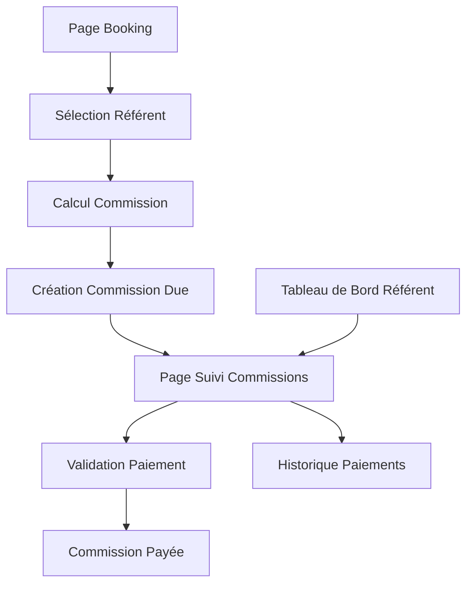

# 📋 Gestion des Commissions Partagées - Spécifications Produit

## 1. Vue d'ensemble du produit

Extension du système de gestion locative pour permettre le partage des marges/commissions avec des référents qui amènent des locataires. Le système doit traquer automatiquement les commissions dues et leur statut de paiement.

## 2. Fonctionnalités principales

### 2.1 Rôles utilisateurs

| Rôle | Méthode d'inscription | Permissions principales |
|------|----------------------|------------------------|
| Gestionnaire | Compte admin existant | Gère tous les bookings, commissions et paiements |
| Référent | Invitation par gestionnaire | Peut voir ses commissions et statuts de paiement |
| Propriétaire | Inscription email | Peut voir ses appartements et paiements |
| Locataire | Inscription email | Peut créer des réservations |

### 2.2 Modules fonctionnels

Notre système de commissions partagées comprend les pages principales suivantes :
1. **Page de gestion des référents** : liste des référents, ajout/modification, historique des commissions
2. **Page de booking étendue** : sélection du référent, calcul automatique des commissions, répartition des marges
3. **Page de suivi des commissions** : tableau de bord des commissions dues, statuts de paiement, historique
4. **Page de paiement des commissions** : validation des paiements, génération de reçus

### 2.3 Détails des pages

| Nom de la page | Nom du module | Description des fonctionnalités |
|----------------|---------------|----------------------------------|
| Gestion des référents | Liste des référents | Afficher tous les référents actifs, ajouter/modifier/désactiver un référent |
| Gestion des référents | Profil référent | Configurer le pourcentage de commission par défaut, méthode de paiement préférée |
| Booking étendu | Sélection référent | Choisir le référent pour la réservation, calculer automatiquement sa commission |
| Booking étendu | Calcul commission | Calculer la répartition : marge totale, part référent, part gestionnaire |
| Suivi commissions | Tableau de bord | Afficher toutes les commissions par statut (dues, payées, en attente) |
| Suivi commissions | Filtres et recherche | Filtrer par référent, période, statut de paiement |
| Paiement commissions | Validation paiement | Marquer une commission comme payée, saisir la date et méthode de paiement |
| Paiement commissions | Historique | Consulter l'historique complet des paiements de commissions |

## 3. Processus principal

### Flux de création d'une réservation avec commission :
1. Le gestionnaire crée une nouvelle réservation
2. Il sélectionne le référent qui a amené le locataire
3. Le système calcule automatiquement la commission du référent (pourcentage de la marge)
4. Une entrée "Commission Due" est créée automatiquement
5. Le gestionnaire peut ensuite marquer la commission comme payée

### Flux de suivi des commissions :
1. Le gestionnaire accède au tableau de bord des commissions
2. Il peut filtrer par référent, période ou statut
3. Il valide les paiements effectués
4. Le référent peut consulter ses commissions via son interface

## 4. Design de l'interface utilisateur

### 4.1 Style de design

- **Couleurs principales** : Bleu (#2563eb) pour les actions principales, Vert (#16a34a) pour les statuts payés
- **Couleurs secondaires** : Orange (#ea580c) pour les commissions dues, Gris (#6b7280) pour les éléments neutres
- **Style des boutons** : Arrondis avec ombres légères, style moderne
- **Police** : Inter ou système par défaut, tailles 14px (corps), 16px (titres), 12px (labels)
- **Style de mise en page** : Design basé sur des cartes, navigation latérale pour les gestionnaires
- **Icônes** : Style outline moderne, emojis pour les statuts (💰 payé, ⏳ en attente, ❌ en retard)

### 4.2 Aperçu du design des pages

| Nom de la page | Nom du module | Éléments UI |
|----------------|---------------|-------------|
| Gestion des référents | Liste référents | Tableau avec colonnes : Nom, Email, Commission %, Commissions totales, Actions. Bouton "Ajouter référent" en haut à droite |
| Booking étendu | Sélection référent | Dropdown avec recherche, affichage du % de commission, calcul en temps réel de la répartition |
| Suivi commissions | Tableau de bord | Cards avec métriques (Total dû, Payé ce mois, En attente), tableau filtrable avec statuts colorés |
| Paiement commissions | Validation | Modal de confirmation avec champs : Date paiement, Méthode, Notes optionnelles |

### 4.3 Responsivité

Interface desktop-first avec adaptation mobile pour les tableaux de bord. Optimisation tactile pour les actions de validation sur tablettes.