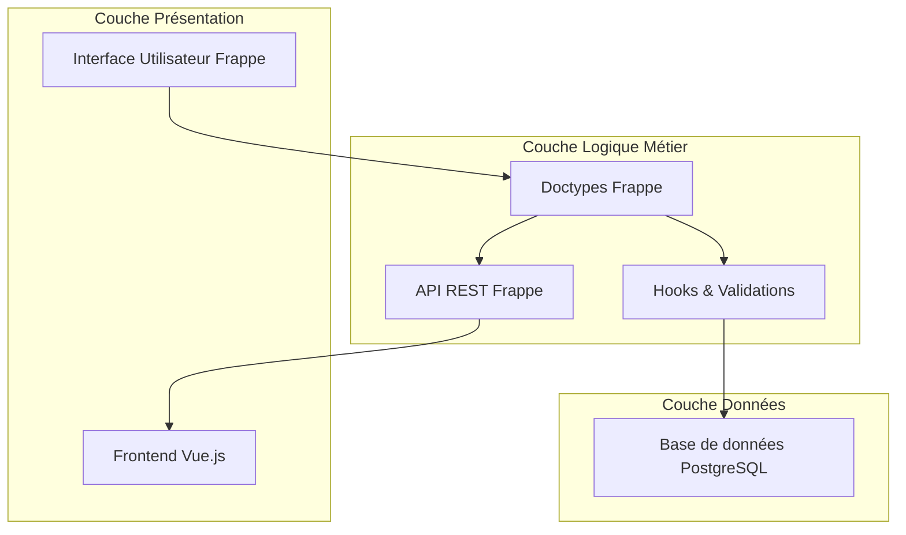
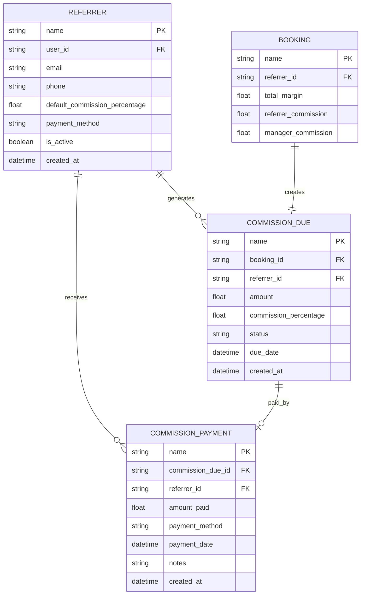

# 🏗️ Architecture Technique - Gestion des Commissions Partagées

## 1. Conception de l'architecture



## 2. Description des technologies

* Frontend : Frappe Framework (interface admin) + Vue.js\@3 (interface client)

* Backend : Frappe Framework (Python)

* Base de données : PostgreSQL (via Frappe)

## 3. Définitions des routes

| Route                                           | Objectif                                                   |
| ----------------------------------------------- | ---------------------------------------------------------- |
| /app/referrer                                   | Page de gestion des référents (liste, ajout, modification) |
| /app/booking                                    | Page de booking étendue avec sélection de référent         |
| /app/commission-due                             | Page de suivi des commissions dues                         |
| /app/commission-payment                         | Page de validation des paiements de commissions            |
| /api/method/immo.api.get\_referrer\_commissions | API pour récupérer les commissions d'un référent           |
| /api/method/immo.api.calculate\_commission      | API pour calculer la commission lors du booking            |

## 4. Définitions des API

### 4.1 API principales

**Calcul de commission**

```
POST /api/method/immo.api.calculate_commission
```

Requête :

| Nom du paramètre | Type   | Obligatoire | Description                    |
| ---------------- | ------ | ----------- | ------------------------------ |
| booking\_id      | string | true        | ID de la réservation           |
| referrer\_id     | string | true        | ID du référent                 |
| total\_margin    | float  | true        | Marge totale de la réservation |

Réponse :

| Nom du paramètre       | Type  | Description                              |
| ---------------------- | ----- | ---------------------------------------- |
| referrer\_commission   | float | Commission du référent                   |
| manager\_commission    | float | Commission restante pour le gestionnaire |
| commission\_percentage | float | Pourcentage appliqué                     |

Exemple :

```json
{
  "booking_id": "BOOK-2024-001",
  "referrer_id": "REF-001",
  "total_margin": 150.00
}
```

**Récupération des commissions d'un référent**

```
GET /api/method/immo.api.get_referrer_commissions
```

Requête :

| Nom du paramètre | Type   | Obligatoire | Description                             |
| ---------------- | ------ | ----------- | --------------------------------------- |
| referrer\_id     | string | true        | ID du référent                          |
| status           | string | false       | Statut des commissions (Due, Paid, All) |
| from\_date       | string | false       | Date de début (YYYY-MM-DD)              |
| to\_date         | string | false       | Date de fin (YYYY-MM-DD)                |

Réponse :

| Nom du paramètre | Type  | Description                  |
| ---------------- | ----- | ---------------------------- |
| commissions      | array | Liste des commissions        |
| total\_due       | float | Total des commissions dues   |
| total\_paid      | float | Total des commissions payées |

## 5. Architecture serveur

```mermaid
graph TD
    A[Requête Client] --> B[Frappe Controller]
    B --> C[Validation Layer]
    C --> D[Business Logic Layer]
    D --> E[ORM Layer (Frappe)]
    E --> F[(Base de données)]
    
    subgraph Serveur Frappe
        B
        C
        D
        E
    end
```

## 6. Modèle de données

### 6.1 Définition du modèle de données



### 6.2 Langage de définition des données

**Table Referrer (referrer)**

```sql
-- Création de la table
CREATE TABLE `tabReferrer` (
    `name` VARCHAR(140) PRIMARY KEY,
    `user_id` VARCHAR(140),
    `email` VARCHAR(255) UNIQUE NOT NULL,
    `phone` VARCHAR(20),
    `default_commission_percentage` DECIMAL(5,2) DEFAULT 10.00,
    `payment_method` VARCHAR(50) DEFAULT 'Bank Transfer',
    `is_active` BOOLEAN DEFAULT TRUE,
    `created_at` DATETIME DEFAULT NOW(),
    `modified` DATETIME DEFAULT NOW()
);

-- Index pour les recherches
CREATE INDEX idx_referrer_email ON `tabReferrer`(email);
CREATE INDEX idx_referrer_active ON `tabReferrer`(is_active);
```

**Table Commission Due (commission\_due)**

```sql
-- Création de la table
CREATE TABLE `tabCommission Due` (
    `name` VARCHAR(140) PRIMARY KEY,
    `booking` VARCHAR(140) NOT NULL,
    `referrer` VARCHAR(140) NOT NULL,
    `amount` DECIMAL(10,2) NOT NULL,
    `commission_percentage` DECIMAL(5,2) NOT NULL,
    `status` VARCHAR(20) DEFAULT 'Due' CHECK (status IN ('Due', 'Paid', 'Cancelled')),
    `due_date` DATE,
    `created_at` DATETIME DEFAULT NOW(),
    `modified` DATETIME DEFAULT NOW()
);

-- Index pour les requêtes fréquentes
CREATE INDEX idx_commission_due_referrer ON `tabCommission Due`(referrer);
CREATE INDEX idx_commission_due_status ON `tabCommission Due`(status);
CREATE INDEX idx_commission_due_date ON `tabCommission Due`(due_date);
```

**Table Commission Payment (commission\_payment)**

```sql
-- Création de la table
CREATE TABLE `tabCommission Payment` (
    `name` VARCHAR(140) PRIMARY KEY,
    `commission_due` VARCHAR(140) NOT NULL,
    `referrer` VARCHAR(140) NOT NULL,
    `amount_paid` DECIMAL(10,2) NOT NULL,
    `payment_method` VARCHAR(50),
    `payment_date` DATE NOT NULL,
    `notes` TEXT,
    `created_at` DATETIME DEFAULT NOW(),
    `modified` DATETIME DEFAULT NOW()
);

-- Index pour l'historique
CREATE INDEX idx_commission_payment_referrer ON `tabCommission Payment`(referrer);
CREATE INDEX idx_commission_payment_date ON `tabCommission Payment`(payment_date DESC);
```

**Modification de la table Booking existante**

```sql
-- Ajout des champs pour les commissions
ALTER TABLE `tabBooking` ADD COLUMN `referrer` VARCHAR(140);
ALTER TABLE `tabBooking` ADD COLUMN `referrer_commission` DECIMAL(10,2) DEFAULT 0.00;
ALTER TABLE `tabBooking` ADD COLUMN `manager_commission` DECIMAL(10,2) DEFAULT 0.00;

-- Index pour les recherches par référent
CREATE INDEX idx_booking_referrer ON `tabBooking`(referrer);
```

**Données initiales**

```sql
-- Insertion d'un référent de test
INSERT INTO `tabReferrer` (name, email, phone, default_commission_percentage, payment_method)
VALUES ('REF-001', 'referrer@example.com', '+33123456789', 15.00, 'Bank Transfer');
```

