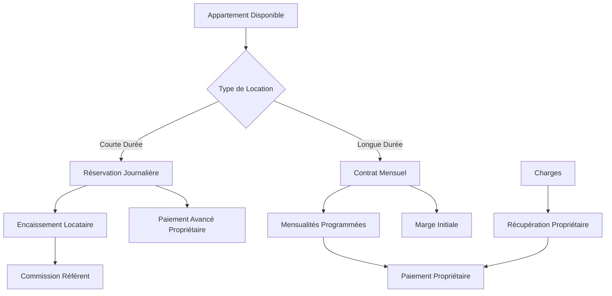

# 🏢 Application de Gestion Immobilière - Spécifications Complètes

## 1. Vue d'ensemble du produit

Application de gestion d'appartements avec deux types de locations distinctes : locations longue durée (mensualités) et courte durée (journalières). Le système gère automatiquement les marges, paiements propriétaires, charges et commissions référents.

## 2. Fonctionnalités principales

### 2.1 Rôles utilisateurs

| Rôle | Méthode d'inscription | Permissions principales |
|------|----------------------|------------------------|
| Gestionnaire | Compte admin | Gère tous les appartements, locations et paiements |
| Propriétaire | Invitation par gestionnaire | Consulte ses appartements et paiements |
| Locataire | Inscription email | Peut consulter ses locations |
| Référent | Invitation par gestionnaire | Consulte ses commissions |

### 2.2 Modules fonctionnels

Notre système de gestion immobilière comprend les pages principales suivantes :
1. **Gestion des appartements** : liste des biens, informations propriétaires, disponibilités
2. **Locations longue durée** : contrats mensuels, suivi des mensualités, gestion des charges
3. **Locations courte durée** : réservations journalières, paiements avancés, commissions référents
4. **Suivi des paiements** : tableau de bord des encaissements et décaissements
5. **Gestion des charges** : enregistrement et récupération auprès des propriétaires
6. **Commissions référents** : calcul et suivi des paiements

### 2.3 Détails des pages

| Nom de la page | Nom du module | Description des fonctionnalités |
|----------------|---------------|----------------------------------|
| Gestion appartements | Liste des biens | Afficher tous les appartements, statuts de disponibilité, informations propriétaires |
| Gestion appartements | Fiche appartement | Détails complets, historique des locations, revenus générés |
| Locations longue durée | Création contrat | Saisir les termes du bail, calculer la marge initiale, programmer les mensualités |
| Locations longue durée | Suivi mensualités | Tableau des paiements attendus/reçus, relances automatiques |
| Locations courte durée | Calendrier réservations | Vue calendrier des disponibilités, création de réservations |
| Locations courte durée | Gestion tarifs | Définir les prix journaliers par période, calcul automatique des marges |
| Suivi paiements | Tableau de bord | Vue d'ensemble des encaissements/décaissements, soldes par propriétaire |
| Suivi paiements | Historique transactions | Détail de tous les mouvements financiers avec filtres |
| Gestion charges | Saisie charges | Enregistrer les dépenses par appartement, catégorisation |
| Gestion charges | Récupération | Calculer les montants à récupérer auprès des propriétaires |
| Commissions référents | Calcul commissions | Attribution automatique selon les réservations apportées |
| Commissions référents | Paiements | Validation et suivi des versements aux référents |

## 3. Processus principaux

### Flux location longue durée :
1. Création du contrat avec marge initiale (généralement 1 mois de loyer)
2. Programmation automatique des mensualités
3. Encaissement des loyers locataires
4. Paiement des propriétaires (loyer - marge)
5. Gestion des charges et récupération

### Flux location courte durée :
1. Paiement avancé au propriétaire (prix journalier × nombre de jours)
2. Création de la réservation avec marge
3. Encaissement du locataire
4. Attribution éventuelle de commission au référent

### Flux gestion des charges :
1. Enregistrement des dépenses par appartement
2. Calcul automatique des montants à récupérer
3. Déduction lors des prochains paiements propriétaires

## 4. Design de l'interface utilisateur

### 4.1 Style de design

- **Couleurs principales** : Bleu (#1e40af) pour les actions, Vert (#059669) pour les paiements reçus
- **Couleurs secondaires** : Orange (#ea580c) pour les impayés, Rouge (#dc2626) pour les charges
- **Style des boutons** : Arrondis modernes avec ombres subtiles
- **Police** : Inter, tailles 14px (corps), 18px (titres), 12px (labels)
- **Style de mise en page** : Dashboard avec cartes métriques, tableaux filtrable, navigation latérale
- **Icônes** : Style outline, emojis pour statuts (🏠 appartement, 💰 paiement, ⏰ en attente)

### 4.2 Aperçu du design des pages

| Nom de la page | Nom du module | Éléments UI |
|----------------|---------------|-------------|
| Dashboard principal | Métriques | Cards avec revenus du mois, appartements occupés, paiements en attente |
| Gestion appartements | Liste | Tableau avec photos, adresses, propriétaires, statuts de disponibilité |
| Locations longue durée | Calendrier mensualités | Vue calendrier des échéances, codes couleur par statut |
| Locations courte durée | Planning | Calendrier interactif avec disponibilités et réservations |
| Suivi paiements | Transactions | Tableau filtrable avec types de paiement, montants, statuts |
| Commissions référents | Dashboard | Graphiques des performances, tableau des commissions dues |

### 4.3 Responsivité

Interface desktop-first avec adaptation mobile pour les consultations. Optimisation tactile pour la saisie rapide des paiements sur tablettes.